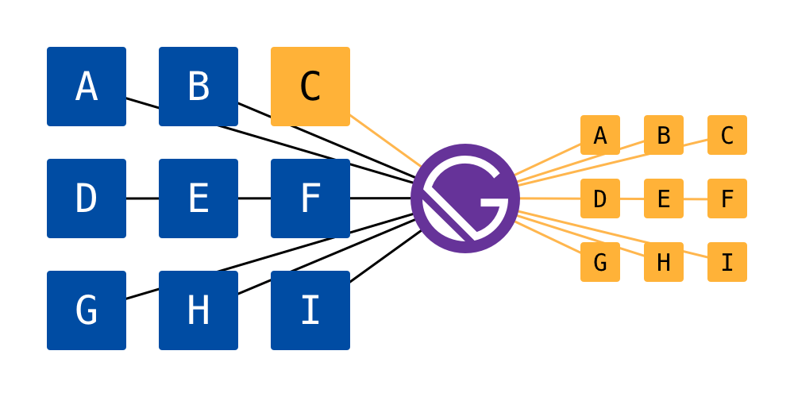
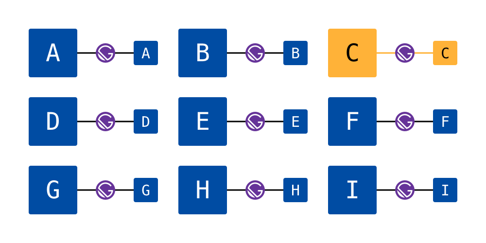
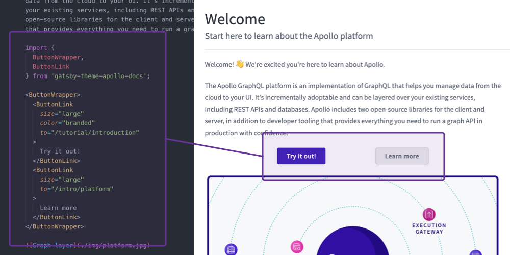
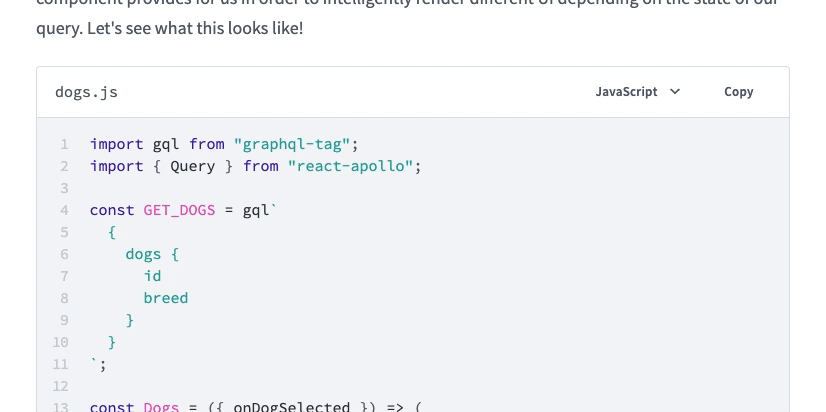
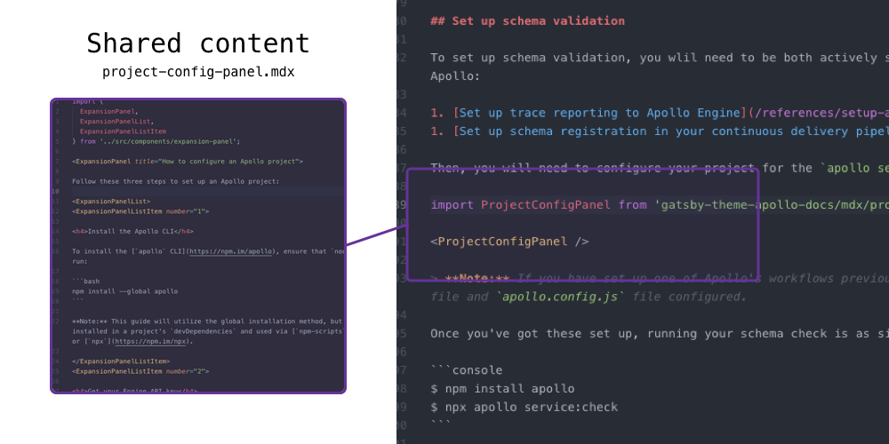
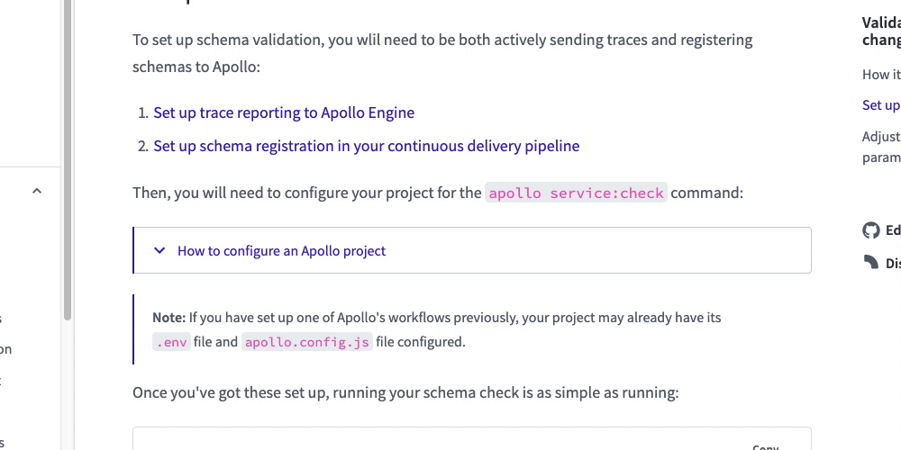

Gatsby is a great tool for building static websites, and offers a lot of value when building pages based on a set of Markdown files. This makes it an ideal partner for building documentation websites, which are typically built statically, and updated by writing Markdown.

At [Apollo](https://www.apollographql.com), our documentation spans multiple repositories. This is good because it keeps different codebases more tightly coupled with their documentation, issues, and PRs. However, when it comes to building a documentation website, this presents us with a challenge:

> How should we bring all of our documentation together into one consistent experience?

Using Gatsby, it would be possible to source files from each repository (using `gatsby-source-git`, for example) and deploy one mega-site. This would satisfy our need to tie all of our repos’ documentation together, but it would also mean that any change in one repo would mean building, testing, and deploying the entire website.

An alternative approach would be for each repo to deploy a piece of the website based on some shared configuration, allowing each of them to exist independently but remain up-to-date with changes to the website layout and infrastructure. In this world, changes to one repo’s documentation only means rebuilding and deploying its small part of the greater website. The goal of this approach is to reduce or remove the bottlenecks involved in making docs changes.

Gatsby Themes are a great choice for this task. Themes allow us to build a full-featured Gatsby website—configuring plugins, writing custom components, using GraphQL queries—one time and apply it to multiple data sources. Themes are highly configurable, so each website can have its own defining features, like a page title, description, and more.

In this blog post, I’m going to talk about some of our favorite parts about using Gatsby Themes to deliver a consistent docs experience.

## Versioning with `gatsby-source-git`

We were able to implement versioned docs by taking advantage of the way that theme configuration works. Normally, a website’s `gatsby-config.js` file would export a JavaScript object, but Themes can include a `gastby-config.js` that exports a function that takes options passed to it by the theme **consumer**, and returns a Gatsby configuration object. You can see how we use this pattern in [our theme’s `gatsby-config.js`](https://github.com/apollographql/gatsby-theme-apollo/blob/master/packages/gatsby-theme-apollo-docs/gatsby-config.js).

The Apollo docs theme accepts a mapping of version numbers to git branches, which it passes along to the `gatsby-source-git` plugin. A theme consumer can specify minimal configuration, and the theme takes care of creating pages and facilitating navigation between versions.

## Leveraging Gatsby Remark plugins

Gatsby’s preeminent Markdown parser, `gatsby-transformer-remark` features a rich ecosystem of useful plugins to do things like code highlighting, adding anchors to headings, and organizing images.

Since Gatsby Remark plugins allow us to look at the Markdown AST of our pages at build time, we were able to create an internal link checker that scans our Markdown for anchor elements and compares them to known page slugs and heading IDs. This helps us to avoid deploying updates containing broken links, without the need to host the changes and check links with third-party software. You can see how we achieve this in [`gatsby-remark-check-links`](https://github.com/trevorblades/gatsby-remark-check-links).

## Sharing components and more

Using [MDX](/docs/mdx/), we’re able to write rich documentation by including React components within a Markdown document. Since `gatsby-plugin-mdx` uses Remark under the hood, all of the Remark plugin features that were mentioned in the last section still apply.

`gatsby-plugin-mdx` also allows us to replace Markdown elements with custom React components using the [`components` prop on the `MDXProvider` component](https://gatsby-mdx.netlify.com/api-reference/mdx-provider). We use this feature to enhance our code blocks with copy buttons, filenames, and multiple language options.

Lastly, MDX introduces the concept of composing pages from shared chunks of content. For example, we may want to document some commonly used steps to set up an Apollo project. Instead of copying and pasting that content into multiple pages, we can write it once as [an MDX file](https://github.com/apollographql/gatsby-theme-apollo/blob/master/packages/gatsby-theme-apollo-docs/mdx/project-config-panel.mdx), import it into other MDX files, and [render it like a React component](https://www.apollographql.com/docs/platform/schema-validation/#set-up-schema-validation). What’s more? Since we’re working with MDX, we can use interactive React elements within the shared content!

## Having fun doing it

The requirements for our docs website infrastructure at Apollo are challenging, but Gatsby Themes, MDX, and a healthy plugin ecosystem give us all the tools we need to deliver a rich, consistent experience across a variety of subjects. This toolset enables us to ship features quickly using familiar technology, and have a great time doing it.

To learn more about our journey with Themes, check out the webinar ["Making Gatsby Even Greater With Themes — Better, Faster, Flexible-er"](https://www.gatsbyjs.com/gatsby-themes/). If you’re interested in how our themes are implemented, [view the source on GitHub](https://github.com/apollographql/gatsby-theme-apollo/tree/master/packages/gatsby-theme-apollo-docs).
